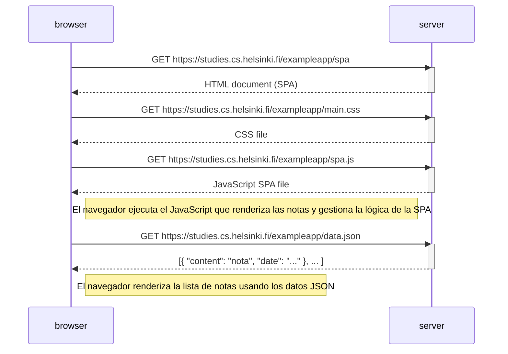

# Ejercicio 0.5: Diagrama de aplicación de una sola página

A continuación se muestra un diagrama de secuencia en sintaxis Mermaid que describe la situación en la que el usuario accede a la versión de aplicación de una sola página de la aplicación de notas en https://studies.cs.helsinki.fi/exampleapp/spa.

