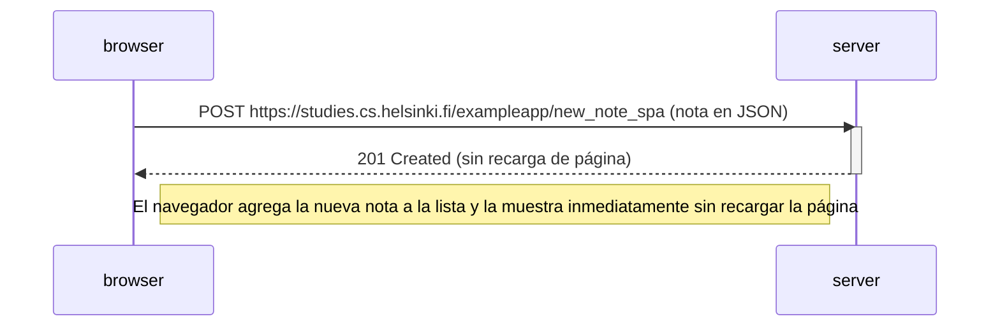

# Ejercicio 0.6: Nueva nota en diagrama de aplicación de una sola página

A continuación se muestra un diagrama de secuencia en sintaxis Mermaid que describe la situación en la que el usuario crea una nueva nota utilizando la versión de una sola página (SPA) de la aplicación de notas en https://studies.cs.helsinki.fi/exampleapp/spa.

